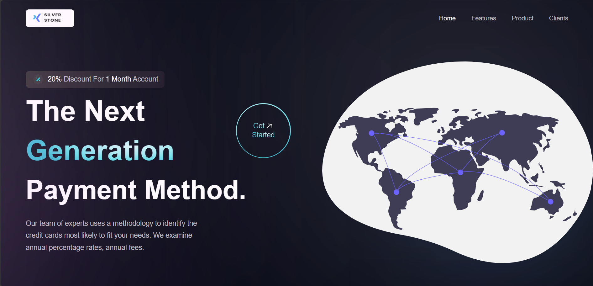
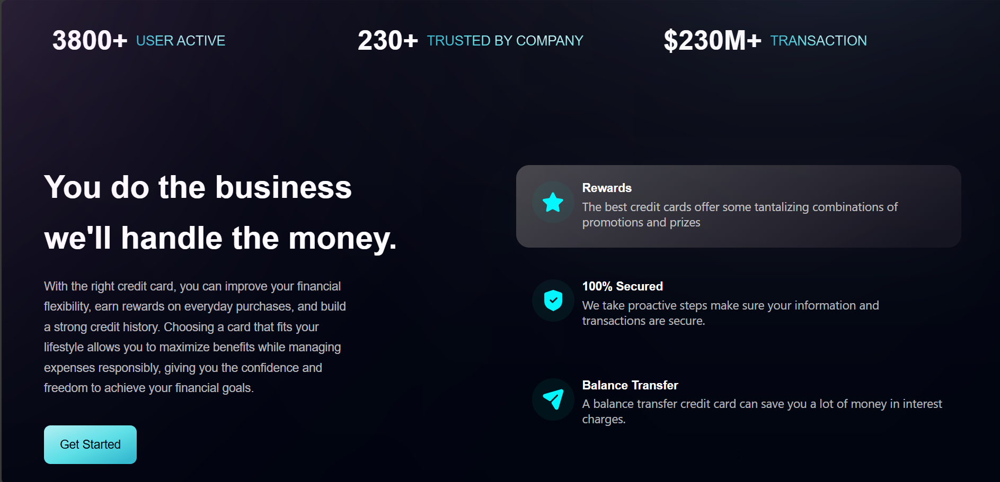
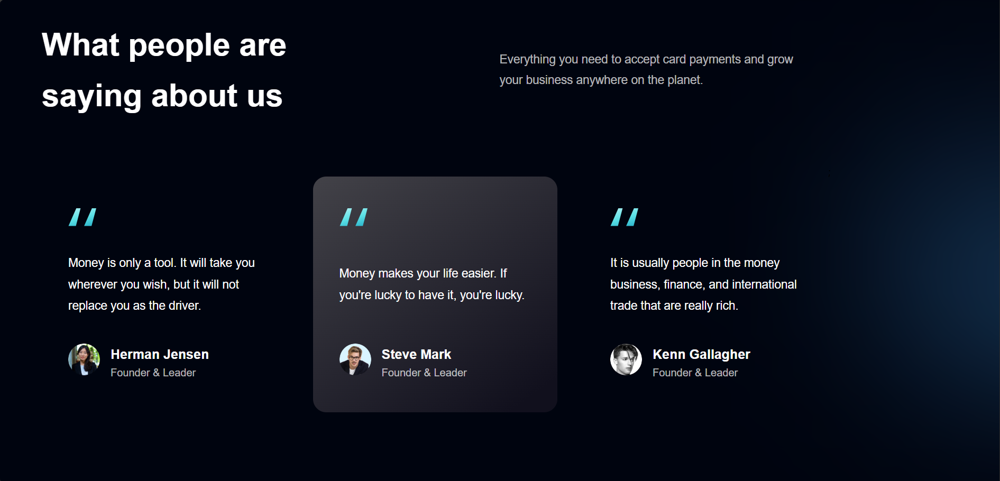

# 🏦 SilverStone Bank – Landing Page

SilverStone Bank is a modern and responsive bank landing page built with React and Tailwind CSS.
The project showcases a professional banking brand through a clean UI, structured sections, and engaging visuals, including customer testimonials and service highlights.

---

## 📸 Screenshots

Here are some snapshots of Silver Stone in action:

- **Head:**  
  

- **Body:**  
  

- **Testimonials:**  
  

---

## ✨ Key Features

- 🧭 Clean and modern banking UI.
- 📱 Fully responsive design (mobile, tablet, desktop).
- 🏦 Bank services and features sections.
- 💬 Customer testimonials section.
- 🎯 Call-to-action sections.
- ⚡ Fast and optimized React components.
- 🎨 Styled entirely with Tailwind CSS.
---

## 🚀 How to Run

1. Clone the repository
2. cd Silver-Stone
3. Open the terminal and type (npm install)
4. Run the porjct (npm run dev)

## 📄 License

This project is licensed under the MIT License.

## 👤 Author

📧 moneebcodebase@gmail.com
🌐 www.linkedin.com/in/moneeb-al-zakoot
💻 https://github.com/moneebcodebase

Feel free to reach out or contribute via GitHub.
